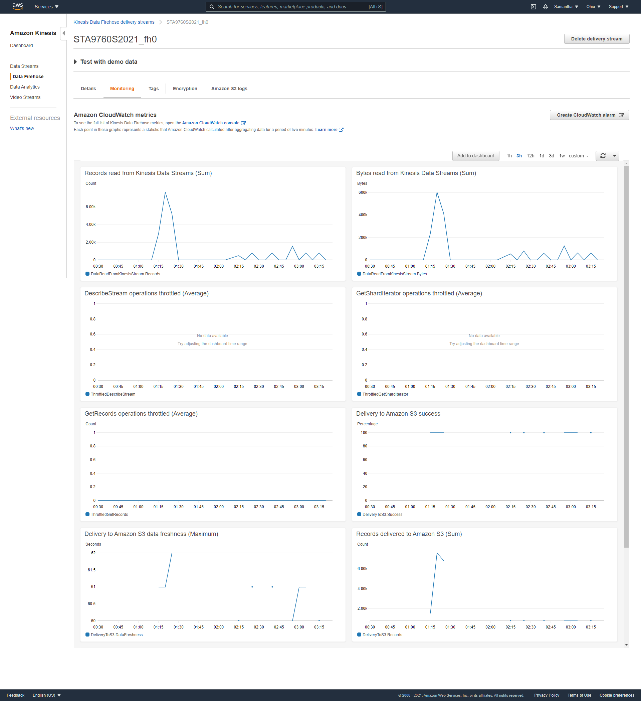
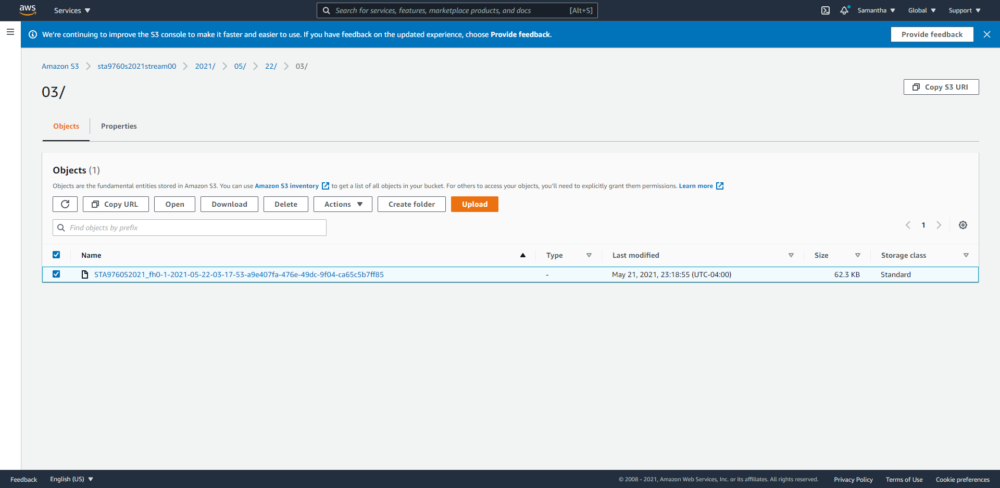

# Streaming Finance Data with AWS Lambda
In this project, we will be streaming "real-time" data, processing the data, and dumping it into a S3 bucket that will analyzed and queried in AWS Athena.
We will be using AWS Kinesis, AWS Lambda, and the yfinance module to pull the stock information and price of the following stocks into a S3 bucket:
- Facebook (FB)
- Shopify (SHOP)
- Beyond Meat (BYND)
- Netflix (NFLX)
- Pinterest (PINS)
- Square (SQ)
- The Trade Desk (TTD)
- Okta (OKTA)
- Snap (SNAP)
- Datadog (DDOG)

Then we will be using AWS Glue to crawl through the S3 bucket and load the data into a queryable format for AWS Athena to query and analyze the data. 

### Kinesis Data Firehose Delivery Stream Monitoring

### S3 Bucket

